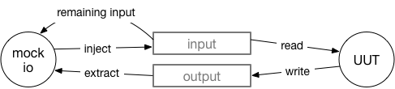

# Mock IO for Erlang

Version 0.1

A simple mock of the Erlang I/O protocol, to allow unit testing code that performs I/O operations (`io:fwrite`, `io:fread`, `file:read`, `file:write`, ...).

By default, it mocks the `standard_io` device by manipulating the group leader, but you can mock any device/file.

Focuses on simplicity and allowing painless mocking of I/O, not on performance.

## Status

Usable, but still beta code. Missing functionalities and API might change without attempting to maintain backward compatibility as long as the version is 0.x.

PRs are welcome! Please explain the use case, focus on simplicity and provide full test coverage.

## Usage examples

### Extracting output from UUT

UUT:
```erlang
-module(uut).
write_to_stdout() ->
    io:fwrite("~p ~p ~s~n", [1, a, "ciao"]).
```

EUnit test:

```erlang
capture_stdout_test() ->
    {IO, GL} = mock_io:setup(),
    uut:write_to_stdout(),
    ?assertEqual(<<"1 a ciao\n">>, mock_io:extract(IO)),
    mock_io:teardown({IO, GL}).
```

### Injecting input to UUT

UUT:

```erlang
-module(uut).
read_from_stdin() ->
    io:get_line("prompt").
```

EUnit test:

```erlang
inject_to_stdin_test() ->
    {IO, GL} = mock_io:setup(),
    mock_io:inject(IO, <<"pizza pazza puzza\n">>),
    ?assertEqual("pizza pazza puzza\n", uut:read_from_stdin()),
    ?assertEqual(<<>>, mock_io:remaining_input(IO)),
    mock_io:teardown({IO, GL}).
```

See also the first tests in `mock_io_test.erl` that show how to use `mock_io` from the point of view of a client.

## Caveats

**Q**: Why the examples perform the setup/teardown themselves instead of using a EUnit fixture?

**A**: Because EUnit performs tricks on the group leader to be able to capture the output of the UUT, and this somehow breaks `mock_io` if we put setup/teardown in a fixture :-( Solving this will probably require to change EUnit code, patches are more than welcome!

## Roadmap

- I would love to see `mock_io` being part of EUnit, and also be usable transparently from Common Test.

## API v0.1

Uses semantic versioning.

### Design



### API calls

```erlang
-spec extract(IO :: pid()) -> Bin :: binary().
```
Extract everything that has been written by the UUT to the output channel
captured by the mock `IO` and return it as `Bin`.

---

```erlang
-spec inject(IO :: pid(), Bin :: binary()) -> ok.
```
Inject `Bin` into the input channel that is mocked for UUT by mock `IO`.

---

```erlang
-spec remaining_input(IO :: pid()) -> binary().
```
Return a copy of what is still available in the input channel of mock `IO`.

---

```erlang
-spec start_link() -> IO :: pid().
```
Start-link a new `mock_io` and return its pid `IO`. If used as-is (as
opposed to call `setup/1`), you must pass `IO` to the UUT (dependency
injection). Often this is not the right function to use; use `setup/0`
instead.

---

```erlang
-spec stop(IO :: pid()) -> ok.
```
Stop synchronously mock_io `IO`. Use this function only if you called
`start_link/0` directly.

---

```erlang
-spec setup() -> {IO :: pid(), GL :: pid()}.
```
Start-link a new `mock_io` and replace the current group leader. This allows
to intercept all I/O done by the UUT either implicitly (e.g.
`io:fwrite(Fmt, Args)`) or by using the default IO server `standard_io`
(e.g. `io:fwrite(standard_io, Fmt, Args)`).
Return tuple `{IO, GL}` containing the mock_io `IO` and the old group leader
`GL`. Normally you can treat `GL` as opaque. When done with the test, you
have to call `teardown/2`.

---

```erlang
-spec teardown({IO :: pid(), GL :: pid()}) -> ok.
```
Stop synchronously mock_io `IO` and reset the current group leader to `GL`,
the one we found when starting the test.
